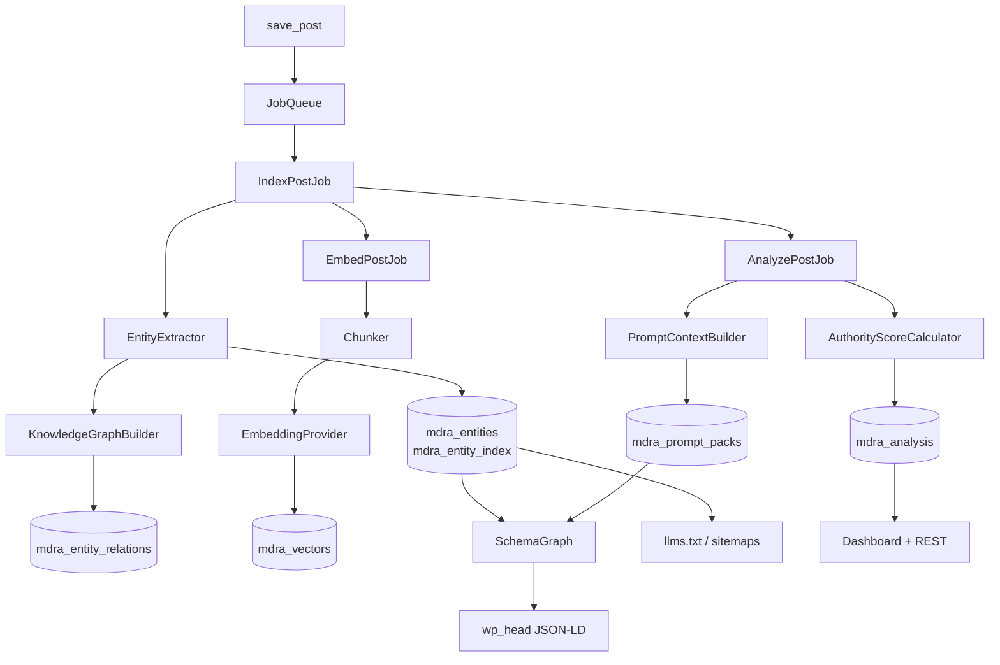

# Architecture

## What this platform is

Medora Authority makes a WordPress site legible to machines that answer
questions. Traditional SEO optimises a page so a *ranking* algorithm places it
in a list. This platform optimises a page so a *reasoning* system can extract a
defensible claim from it, attribute that claim to an accountable author, and
cite the source.

Those are different jobs, and they imply different primitives: entities instead
of keywords, chunks instead of pages, and an explainable score instead of a
traffic-light meter.

## Composition root

```
medora-authority.php          bootstrap, constants, activation hooks
  └── Core\Autoloader          PSR-4 fallback for Medora\Authority\
  └── Core\Plugin              composition root — builds the container, boots modules
        ├── Core\Container     PSR-11-style DI with constructor autowiring
        ├── Core\Options       one autoloaded option, typed accessors
        ├── License\LicenseManager
        └── Module\ModuleRegistry
```

`Plugin::boot()` runs on `plugins_loaded` at priority 20, late enough that
third-party integrations registered on the default priority can hook
`medora_module_classes` and `medora_register_modules` before anything resolves.

## Module lifecycle

Every capability ships as a module implementing `ModuleInterface`. The registry
enforces a strict two-phase lifecycle:

| Phase        | Allowed                              | Forbidden                                    |
|--------------|--------------------------------------|----------------------------------------------|
| `register()` | bind services into the container     | DB queries, hooks, assuming other modules run |
| `boot()`     | add hooks, start work                | —                                            |

The separation is what makes modules genuinely independent: `register()` cannot
observe boot order, so a module can never accidentally depend on one that
happens to load earlier.

Before booting, the registry filters modules three ways — enabled state, licence
tier, then dependency satisfaction — and topologically sorts what survives.
A module whose dependency was filtered out is skipped with a recorded reason
(surfaced in the dashboard) rather than fataling.

### Module map

| Module        | Depends on                | Tier   | Owns                                        |
|---------------|---------------------------|--------|---------------------------------------------|
| `security`    | —                         | Free   | audit log, configuration scanner            |
| `performance` | —                         | Free   | cache, job queue, worker                    |
| `license`     | —                         | Free   | activation, transfer, update channel        |
| `entity`      | `performance`             | Free   | extraction, entity store, authority scoring |
| `graph`       | `entity`                  | Free   | triples, JSON-LD export                     |
| `semantic`    | `entity`                  | Free   | density, coverage, answer readiness         |
| `vector`      | `performance`             | Pro    | embeddings, semantic search                 |
| `schema`      | `entity`                  | Free   | JSON-LD graph, validation                   |
| `crawler`     | —                         | Free   | detection, policy, robots.txt, crawl log    |
| `llms`        | —                         | Free   | `/llms.txt`, `/llms-full.txt`               |
| `sitemap`     | `entity`                  | Free   | annotated sitemaps (XML/JSON/Markdown)      |
| `prompt`      | `entity`                  | Pro    | summaries, canonical answers, fact sheets   |
| `llm`         | `prompt`, `performance`   | Agency | verified generative rewriting (opt-in, off) |
| `content`     | `score`, `semantic`       | Pro    | prioritised recommendations                 |
| `linking`     | `vector`, `entity`        | Pro    | internal link suggestions                   |
| `citation`    | —                         | Pro    | DOI/PubMed resolution, formatting           |
| `eeat`        | —                         | Free   | author credentials, trust scoring           |
| `medical`     | `entity`                  | Pro    | clinical ontology, review metadata          |
| `analytics`   | —                         | Free   | AI referral tracking                        |
| `score`       | `entity`,`semantic`,`schema` | Free | the AI Authority Score                      |
| `rest`        | —                         | Free   | REST controllers, rate limiting             |
| `admin`       | `rest`                    | Free   | dashboard, meta box, setup wizard           |
| `white_label` | —                         | Agency | branding overrides                          |

## Data flow



Nothing heavy runs on the request that triggered it. `save_post` enqueues; cron
drains. The chain is explicit rather than one large job so a failure in
embedding generation — which may involve a remote API — never rolls back a
successful entity pass.

## Why work is deferred

Extraction plus embedding plus scoring is measured in hundreds of milliseconds
on a long page. Running that inline on publish is the single most common reason
SEO plugins get uninstalled. The queue is a real table with status, attempt
counts and exponential back-off because WordPress cron is a tick, not a
scheduler: it only fires when someone visits, and `wp_schedule_single_event`
silently drops duplicates.

## Extension points

Three layers, in increasing order of commitment:

1. **Hooks** — `medora_entity_dictionary`, `medora_schema_graph`,
   `medora_authority_score`, `medora_crawler_registry` and the rest. Documented
   in `docs/03-api-reference.md`.
2. **Interfaces** — implement `ExtractorInterface`, `ScorerInterface`,
   `NodeInterface`, `EmbeddingProviderInterface` or `JobInterface` and register
   it on the matching `do_action`.
3. **Modules** — a full `ModuleInterface` added via `medora_module_classes`,
   with its own services, hooks and dependency declarations.

Third-party code should consume `Sdk\Medora`, not the repositories. Repository
signatures are internal and may change between minor versions; the facade is
the supported contract and degrades gracefully when a module is disabled.

## Performance posture

- **Conditional assets.** The dashboard bundle loads only on Medora screens; the
  editor bundle only on `post.php`/`post-new.php`. Nothing is enqueued on the
  front end.
- **One option read.** Every setting lives under a single autoloaded option, so
  a settings read costs one row from the autoload cache rather than one query
  per setting.
- **Content-hash short circuits.** Analysis, embedding and prompt-pack
  generation all skip entirely when the content hash is unchanged.
- **Cached aggregates.** Crawl and referral reports are `GROUP BY` scans cached
  for fifteen minutes behind the object cache, with a transient fallback.
- **Linear vector scan, honestly bounded.** Brute-force cosine over a few
  thousand chunks runs in tens of milliseconds and needs no extension. Past
  ~20k chunks the stats endpoint flags it and `medora_vector_search` lets an
  external index take over without touching calling code.
