# Database schema

Eleven tables, all prefixed `{$wpdb->prefix}mdra_`. Definitions live in one
place — `Core\Tables` — and are applied through `dbDelta()`, which is additive:
it creates missing tables, columns and indexes but never drops data. That makes
the same method safe to call on activation and on upgrade.

## ER diagram

```mermaid
erDiagram
    entities ||--o{ entity_index : "appears on"
    entities ||--o{ entity_relations : "subject of"
    entities ||--o{ entity_relations : "object of"
    wp_posts ||--o{ entity_index : "mentions"
    wp_posts ||--o{ vectors : "chunked into"
    wp_posts ||--|| analysis : "scored as"
    wp_posts ||--|| prompt_packs : "summarised as"
    wp_posts ||--o{ citations : "cites"
    wp_posts ||--o{ ai_referrals : "landed on"
    wp_posts ||--o{ crawler_hits : "fetched as"

    entities {
        bigint id PK
        varchar entity_uid UK "sha256(type|normalised name)"
        varchar entity_type "Schema.org type"
        varchar name
        varchar canonical_name "normalised, indexed"
        text description
        varchar object_type "post|term|user|virtual"
        bigint object_id
        longtext same_as "JSON: external identifiers"
        decimal authority_score "0-100"
        decimal confidence "0-1"
    }

    entity_relations {
        bigint id PK
        bigint subject_id FK
        varchar predicate "Schema.org property"
        bigint object_id FK
        decimal weight "0-1"
        varchar source "cooccurrence|manual|imported"
    }

    entity_index {
        bigint id PK
        bigint entity_id FK
        varchar object_type
        bigint object_id
        int occurrences
        decimal salience "0-1"
    }

    vectors {
        bigint id PK
        varchar object_type
        bigint object_id
        smallint chunk_index
        varchar provider
        longblob embedding "packed float32"
        double magnitude
        char content_hash
    }

    analysis {
        bigint id PK
        varchar object_type
        bigint object_id
        decimal overall_score
        longtext components "JSON"
        longtext deductions "JSON"
        char content_hash
    }

    prompt_packs {
        bigint id PK
        varchar object_type
        bigint object_id
        text summary
        text canonical_answer
        longtext questions "JSON"
        longtext facts "JSON"
        longtext context_window
    }

    citations {
        bigint id PK
        varchar object_type
        bigint object_id
        varchar doi
        varchar pmid
        text title
        longtext authors "JSON"
        varchar evidence_level
        decimal quality_score
    }

    crawler_hits {
        bigint id PK
        varchar crawler_slug
        varchar vendor
        varchar request_uri
        smallint status_code
        varchar decision
        char ip_hash "salted HMAC"
        datetime hit_at
    }

    ai_referrals {
        bigint id PK
        varchar source_slug
        varchar referrer_host
        varchar landing_uri
        char visitor_hash "salted, rotates daily"
        datetime occurred_at
    }

    audit_log {
        bigint id PK
        bigint user_id
        varchar action
        longtext context "JSON, secrets redacted"
        datetime created_at
    }

    jobs {
        bigint id PK
        varchar queue
        varchar handler
        longtext payload "JSON"
        varchar status "pending|running|failed"
        tinyint attempts
        datetime available_at
    }
```

## Design decisions worth knowing

**Entity identity is deterministic, not sequential.** `entity_uid` is
`sha256(type|normalised_name)` truncated to 40 characters. Re-running extraction
over a site converges instead of duplicating, and the same entity found by two
different extractors on two different pages resolves to one row. Normalisation
folds Arabic character forms to Persian, so `علي` and `علی` are the same doctor.

**Salience is stored per occurrence, not per entity.** `entity_index` answers
"how much is *this page* about this entity", which is what schema `mentions`,
prompt packs and link suggestions all rank on. An entity's site-wide standing
lives separately in `entities.authority_score`.

**Vectors are packed float32, not JSON.** A 1536-dimension vector is ~6 KB
packed against ~30 KB as a JSON array, and decoding is one `unpack()` rather
than a JSON parse per row. On a site with 5,000 chunks that is the difference
between a usable search and an unusable one.

**Content hashes gate every expensive path.** `analysis`, `prompt_packs` and
`vectors` all store the hash of the content they were derived from. Re-running
analysis on unchanged content is a single indexed lookup, which matters when a
remote embedding API charges per call.

**Nothing identifying is stored in the clear.** `ip_hash` and `visitor_hash` are
salted HMACs using a per-install salt, so hashes are not comparable across sites
and a leaked table is not a rainbow-table target. The visitor salt additionally
rotates daily, which bounds how long a visitor is trackable to under 24 hours
and is why the analytics module needs no consent banner.

**The audit log is append-only.** There is no update or targeted delete method
on `AuditLogRepository`. Rows leave only through the retention pruner, which
removes by age. Audit rows are also kept at least twice as long as operational
logs — they are the record you need after an incident, not during one.

## Indexing

Every query the platform issues is covered:

| Table              | Index                                | Serves                                  |
|--------------------|--------------------------------------|-----------------------------------------|
| `entities`         | `entity_uid` (unique)                | upsert convergence                      |
| `entities`         | `object_lookup (object_type, object_id)` | resolving a term/user to its entity |
| `entities`         | `authority_score`                    | ranked entity listings                  |
| `entity_relations` | `triple` (unique)                    | idempotent edge writes                  |
| `entity_index`     | `entity_object` (unique)             | idempotent link writes                  |
| `entity_index`     | `object_lookup`                      | "entities on this page"                 |
| `vectors`          | `chunk` (unique)                     | idempotent chunk writes                 |
| `analysis`         | `object_lookup` (unique)             | cached score lookup                     |
| `crawler_hits`     | `crawler_day (crawler_slug, hit_at)` | the daily-series `GROUP BY`             |
| `jobs`             | `claim (status, available_at)`       | the worker's claim query                |

## Migrations

`Core\Migrator::maybe_upgrade()` runs on every request but short-circuits on a
version comparison before issuing any query. When the stored version trails the
shipped one it re-runs `dbDelta()` (additive, safe) and then applies any data
migrations registered for versions in between.

## Uninstall

`uninstall.php` drops nothing by default. Data is destroyed only when the
operator opts in via the `medora_delete_data_on_uninstall` option or the
`MEDORA_REMOVE_ALL_DATA` constant. Deleting a knowledge graph that took weeks to
build because someone uninstalled to test something is not a recoverable
mistake. Scheduled events and transients are always cleaned up regardless.
