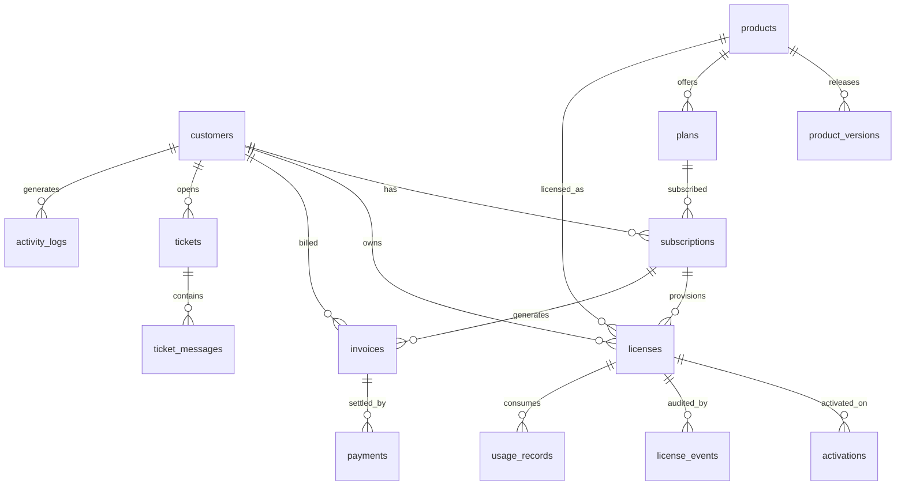

# SLM — Database Design

MySQL 8+, utf8mb4, InnoDB. All money columns are `DECIMAL(12,2)` + a `currency` CHAR(3)
column (IRR, AED, USD). All timestamps UTC.

## ERD

## Tables

### customers
`id, uuid, type ENUM(doctor,clinic,hospital,company,startup,individual), name,
company_name, email UNIQUE, phone, country CHAR(2), city, locale ENUM(fa,en,ar),
billing_address JSON, tax_id, password, notes, is_blocked, timestamps, soft deletes`
— Index: `email`, `(type, country)`.

### products
`id, uuid, name, slug UNIQUE, key_prefix CHAR(3..5) UNIQUE ('MED','SBT','SEO','QRC'),
category, description, status ENUM(active,hidden,retired), signing_secret (encrypted),
metadata JSON, timestamps`

### product_versions
`id, product_id FK, version VARCHAR(20), channel ENUM(stable,beta), release_notes TEXT,
min_php, min_wp, artifact_path, artifact_sha256 CHAR(64), download_count, released_at,
timestamps` — Unique: `(product_id, version)`; Index: `(product_id, channel, released_at)`.

### plans
`id, product_id FK, name, slug, tier ENUM(starter,professional,clinic,agency,enterprise),
billing_cycle ENUM(monthly,yearly,lifetime), price DECIMAL, currency CHAR(3),
activation_limit SMALLINT, trial_days SMALLINT, grace_days SMALLINT DEFAULT 14,
monthly_token_limit BIGINT NULL (AI quota), features JSON, is_active, timestamps`
— Unique: `(product_id, slug, billing_cycle)`.

### subscriptions
`id, uuid, customer_id FK, plan_id FK, status ENUM(trialing,active,past_due,grace,
cancelled,expired), current_period_start, current_period_end, trial_ends_at,
cancelled_at, auto_renew BOOL, gateway VARCHAR(20), gateway_ref, timestamps`
— Index: `(customer_id, status)`, `(status, current_period_end)` (renewal scheduler scan).

### licenses
`id, uuid, license_key VARCHAR(25) UNIQUE ('MED-XXXX-XXXX-XXXX'), customer_id FK,
product_id FK, subscription_id FK NULL, plan_id FK NULL, status ENUM(pending,active,
grace,expired,suspended,revoked), activation_limit SMALLINT, expires_at NULL
(NULL = lifetime), grace_ends_at NULL, transfers_used SMALLINT DEFAULT 0, notes,
timestamps` — Index: `license_key`, `(customer_id, status)`, `(status, expires_at)`
(daily expiry sweep).

### activations
`id, license_id FK, domain VARCHAR(255), domain_hash CHAR(64) (sha256, used for lookups
— privacy), site_url, ip VARCHAR(45), device_fingerprint CHAR(64), environment
ENUM(production,staging,local), sdk_version, wp_version, php_version, is_active BOOL,
activated_at, deactivated_at, last_seen_at, timestamps`
— Unique: `(license_id, domain_hash)` where active; Index: `(license_id, is_active)`,
`last_seen_at`.
— Local/staging domains (localhost, *.test, *.local, staging.*) don't count against the
activation limit (Freemius-style dev-site courtesy).

### license_events  (immutable audit log — no updates, no deletes)
`id, license_id FK, event ENUM(created,activated,deactivated,validated_fail,renewed,
expired,grace_entered,suspended,unsuspended,revoked,transferred,limit_exceeded,
suspicious), actor_type ENUM(system,admin,customer,api), actor_id NULL, ip, meta JSON,
created_at` — Index: `(license_id, created_at)`, `(event, created_at)`.

### invoices
`id, uuid, number UNIQUE (SLM-YYYY-000001), customer_id FK, subscription_id FK NULL,
status ENUM(draft,open,paid,void,refunded), subtotal, tax, total, currency,
due_at, paid_at, pdf_path, line_items JSON, timestamps`

### payments
`id, uuid, invoice_id FK, gateway ENUM(zarinpal,nextpay,stripe,manual,bank_transfer),
gateway_ref, amount, currency, status ENUM(pending,succeeded,failed,refunded),
failure_reason, raw_response JSON, paid_at, timestamps`
— Index: `(gateway, gateway_ref)`.

### usage_records  (MEDORA AI metering)
`id, license_id FK, service ENUM(ai_chat,lead_score,summary,pdf_export,sheets_sync,
crm_sync), tokens_used INT, request_count INT DEFAULT 1, period CHAR(7) ('2026-07'),
meta JSON, created_at` — Index: `(license_id, period, service)`.
Aggregated monthly; hot counters live in Redis (`slm:quota:{license}:{period}`), flushed
hourly to MySQL.

### tickets / ticket_messages
`tickets: id, uuid, customer_id FK, license_id FK NULL, subject, status ENUM(open,
pending,answered,closed), priority ENUM(low,normal,high,urgent), timestamps`
`ticket_messages: id, ticket_id FK, author_type ENUM(customer,admin), author_id, body,
attachments JSON, created_at`

### activity_logs
`id, customer_id FK NULL, admin_id FK NULL, action, subject_type, subject_id, ip,
meta JSON, created_at` — generic actor activity for Module 1.

## Key decisions

- **`domain_hash` alongside raw domain**: lookups and uniqueness use SHA-256 of the
  normalized domain; raw value kept for admin display only.
- **License ↔ subscription is nullable**: perpetual/manual licenses exist without a
  subscription (Enterprise deals, lifetime tier).
- **Audit table is append-only**: enforced at the repository layer (no update/delete
  methods) and by MySQL user grants in production.
- **Renewal/expiry sweeps are index-driven**: `(status, current_period_end)` and
  `(status, expires_at)` keep the daily cron O(rows-due), not O(all).
